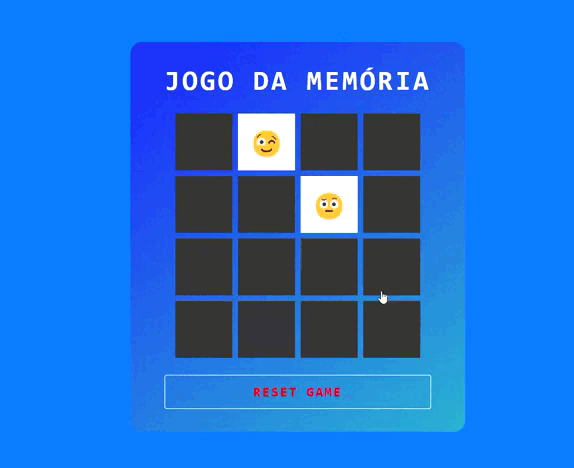

# Jogo da memória

Um jogo da memória feito para o desafio da trilha de lógica de programação do bootcamp de HTML e CSS da DIO, passando por todos conceitos aprendidos na trilha.

🔗[Link para jogar](leuxtc.github.io/jogo-da-memoria/)

